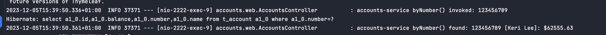
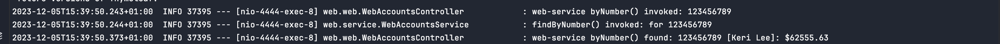
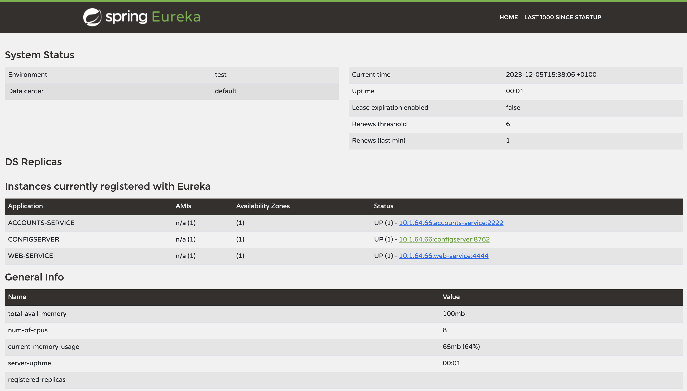
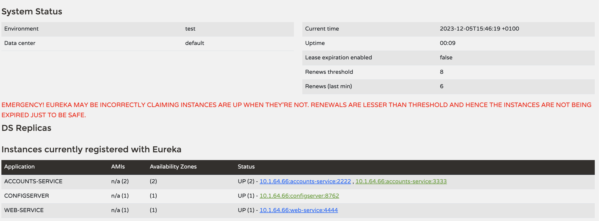
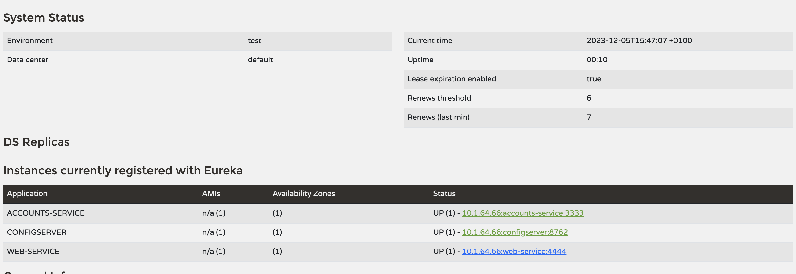
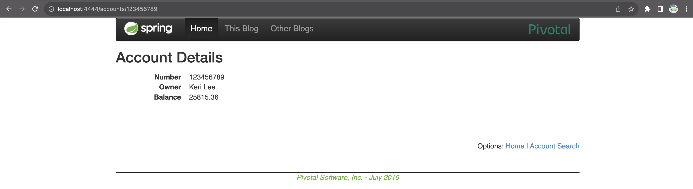

# Web Engineering 2023-2024 / Microservices

Please, go to the [GUIDE](docs/GUIDE.md) in order to get the instructions for this assignment.

Some ideas for obtaining a :gift: if you are the first that:

* [Circuit breaker for the requests from web to accounts that avoids the 500 error](https://spring.io/guides/gs/cloud-circuit-breaker/).
* [Dockerize the four services](https://spring.io/guides/topicals/spring-boot-docker).
* [Docker compose with scale by command line](https://thepracticaldeveloper.com/dockerize-spring-boot/).

### Apartado 1: Two services accounts (2222) and web are running and registered (two terminals). 2 Log screenshot.

Para completar este apartado he añadido las siguientes lineas de configuración:

En el fichero accounts-service.yml he añadido a la aplicacion:

    spring:
  application:
    name: accounts-service  # Identify this application
    cloud:
    config:
      uri: http://localhost:8888/
      name: accounts-service
      profile: default

   server:
  port: 2222 

En el fichero web-service.yml he añadido a la aplicacion:

    spring:
  application:
    name: web-service  # Identify this application
    cloud:
    config:
      uri: http://localhost:8888/
      name: web-service
      profile: default

De esta manera he conseguido que los dos servicios se registren en el servidor de configuración.
Despues he lanzado los diferentes componentes de la aplicación y me he conectado desde el navegador

A continuación se puede ver que la conexion ha sido existosa:

### Apartado 2: The service registration service has these two services registered (a third terminal). Eureka dashboard screenshot.

A continuación se puede ver la foto del Eureka dashboard con los dos servicios:

### Apartado 3: Update the configuration repository so that the accounts service uses now the port 3333. Link to the commit.

Para ello modificamos la configuracion en el yml de la siguiente manera:

server:
  port: 3333

El commit se puede ver en:

https://github.com/cmoro2002/lab6-microservices-config-repo/commit/9832f613c30e40cfead7a12e9dd6ec9ada3457a1

### Apartado 4: Run a second instance of the accounts service using the new configuration (a fourth terminals). What happens? Explain and Eureka dashboard screenshot

Se puede lanzar un segundo servicio de accounts sin necesidad de detener la ejecución de los demás componentes, pero en el dashboard se detecta que hay algo incorrecto

Como se puede ver en la siguiente foto:

Se puede ver que hay 2 instancias de accounts service con las dos en status "UP"

### Apartado 5: What happens when you kill the service accounts (2222) and do requests to web?. Explain and screenshots, including at least one Eureka dashboard screenshot

Cuando se mata el proceso accounts 2222, el servicio web sigue funcionando correctamente, pero en el dashboard se puede ver que ya no esta el servicio accounts 2222. Al conectarse se puede ver que todo funciona correctamente en el puerto 3333

### Apartado 6: Can the web service provide information about the accounts again?. Why? Explain and screenshots, including at least one Eureka dashboard screenshot

Si, devuelve la información de accounts en el puerto 3333, es decir la segunda instancia. A continuación se puede ver la información en eureka dashboard:

